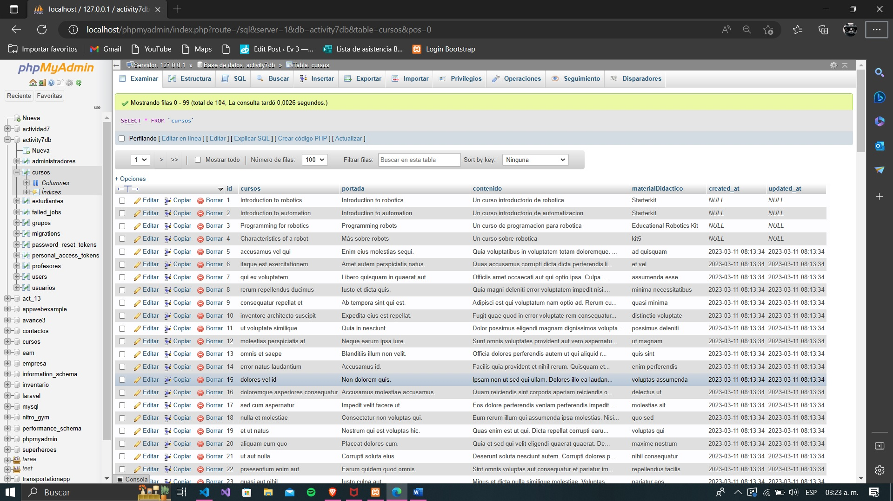
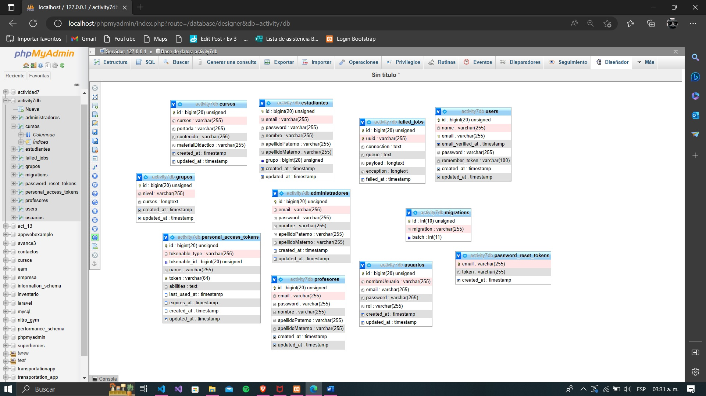

### Angel Santiago Delgado Mendoza 2959951

# Nombre del proyecto
- Actividad 7 y Tarea 6
# Descripción del proyecto
- Práctica sobre el uso de migraciones, seeders y factories en laravel
# Gráfico ER
- Evidencia de las tablas:

- Diagrama ER en el repositorio

